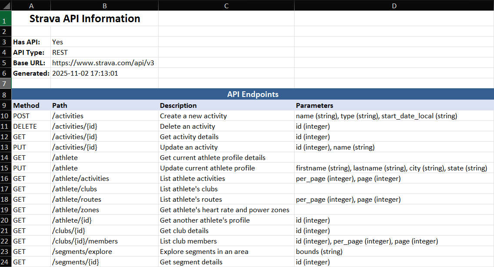

# AI API Discovery Agent

Automatically discover and document company APIs using FREE DeepSeek AI.

## Overview

This tool uses AI to intelligently search for company API documentation and exports the information to Excel spreadsheets. Completely FREE - uses DeepSeek AI via OpenRouter.

## Features

- 🤖 **FREE AI-Powered** - Uses DeepSeek AI (no costs)
- 📊 **Excel Export** - Clean, formatted spreadsheets
- 🔍 **Smart Discovery** - Finds documentation URLs, API types, and descriptions
- 🎯 **Simple** - Only 2 dependencies, clean code

## Installation

1. **Clone the repository:**

```bash
git clone https://github.com/GerritSt/API-discovery-agent.git
cd API-discovery-agent
```

2. **Install dependencies:**

```bash
pip install requests openpyxl
```

3. **Get FREE API key:**

   - Visit: https://openrouter.ai/keys
   - Sign up (free account)
   - Create API key
   - Copy your key

4. **Set environment variable:**

```bash
# Windows
set OPENROUTER_API_KEY=your-api-key-here

# Linux/Mac
export OPENROUTER_API_KEY=your-api-key-here
```

## Usage

### Basic Usage

```bash
python src/main.py "Stripe"
```

### With Custom Output

```bash
python src/main.py "GitHub" --output github_api.xlsx
```

### With Verbose Logging

```bash
python src/main.py "Twilio" --verbose
```

### Test It

```bash
python test_ai.py
```

## Project Structure

```
API-discovery-agent/
├── src/
│   ├── ai_api_discovery.py    # AI logic (requests to OpenRouter)
│   ├── excel_exporter.py      # Excel file generation
│   └── main.py                # CLI entry point
├── data/                       # Output folder (Excel files)
├── test_ai.py                 # Test script
├── simple_example.py          # Minimal usage example
├── requirements.txt           # Dependencies
├── README.md                  # This file
└── NOTES.md                   # Developer notes
```

## Dependencies

Only 2 packages required:

- **requests** - HTTP requests for AI API
- **openpyxl** - Excel file creation

## Output

Excel files are saved to `outputdata/` folder with:

- Company information
- API type (REST, GraphQL, SOAP, etc.)
- Main documentation URL
- List of documentation pages with titles and URLs
- Timestamp

## Example ouput



## Why FREE?

- Uses **deepseek/deepseek-chat-v3.1:free** model via OpenRouter
- No costs, no billing info needed
- Excellent quality results
- No usage limits for reasonable use

## License

Open source - free to use and modify.

## Links

- Get API Key: https://openrouter.ai/keys
- Repository: https://github.com/GerritSt/API-discovery-agent
